# Blog Soul


A fully responsive blog website built with Django. This project supports user authentication, dynamic content, and searching with trigram similarity.

## Overview

This project is a blogging platform that enables users to create, edit, and delete blog posts. Visitors can view posts and search for specific content, Users can register, log in, and manage their own posts.

## UX

This site was designed with the Five Planes of UX methodology.

### Strategy

**Goal:** Create an intuitive, responsive, and feature-rich blogging platform for users to share and discover content.

**Objectives:**

- Provide user-friendly interfaces for browsing and managing posts.
- Implement robust search functionality to improve content discovery.
- Ensure seamless mobile and desktop experiences.

### Scope

**User Features:**

- Responsive layout across devices.
- CRUD functionality for blog posts.
- Authentication and account management.
- Search functionality with trigram similarity.

Only owners of a data instance can access any CRUD functionality related to it. All get requests returning a list will only return items for which the user is the owner. Any requests for a specific item that the user doesn't own will be denied.

**Admin Features:**

- Manage user posts.
- View and delete inappropriate content.

### Agile Methodology

This project was developed using the Agile methodology.  
All epics and user stories implementation progress was registered using [GitHub](https://github.com/). As the user stories were accomplished, they were moved in the GitHub Kanban board from **ToDo**, to **In Progress**, **Done** and **Not Implemented** lists.
The board can be viewed [here](https://github.com/users/OJarvey/projects/5)

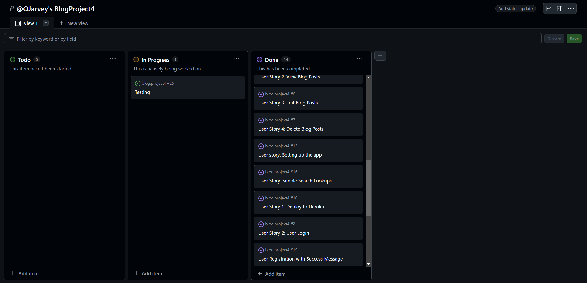

### Sprint 1: Base Setup

| EPIC          | User Story               | Description                                                                                                                               |
| :------------ | :----------------------- | :---------------------------------------------------------------------------------------------------------------------------------------- |
| Project Setup | Project setup            | As a developer, I need to set up the project so that it is ready for implementing the core features.                                      |
| Deployment    | PostgreSQL               | As a developer, I need the PostgreSQL information provided by Code Institute to link the database to the project.                               |
| Deployment    | Heroku                   | As a developer I need to deploy the finished project to Heroku so that it can be accessed by everyone.                                    |
| Project Setup | File structure           | As a developer I need to set up the file structure in the project so that all the files can be accessed and created in the correct place.|
| Project Setup | Database models          | As a developer I need to create the database models so that the can be used by the app.                                                   |
| Project Setup | Link CSS, JS & Bootstrap | As a developer I can link up Bootstrap and custom CSS & JavaScript into base.html so the site can be styled.                          |
| Project Setup | base.html                | As a developer I need to create the base.html page and structure so that other pages can use the layout.                                  |
| Project Setup | Google Fonts             | As a developer I can link in google fonts so that the site can have custom fonts.                                                         |
| UX            | Favicon                  | As a developer I can add a favicon so the user can see the site logo easily in the web browser. |

### Sprint 2: Navigation & Account Creation

| EPIC           | User Story             | Description                                                                                                              |
| :------------- | :--------------------- | :----------------------------------------------------------------------------------------------------------------------- |
| Navigation     | Navbar                 | As a developer, I need to create a navbar so that users can navigate the site.                                            |
| CRUD           | View Blog Posts | As a user, I can see all the available blog posts so that I can read and interact with content.                          |
| Navigation     | Icon                  | As a developer I need to create a way for users to go home and to create new post from anywhere on the website.                         |
| UX             | Whitenoise             | As a developer, I need to set up Whitenoise so that my static files can be served in deployment.                           |
| Authentication | Add email address      | As a site user, I can supply my email address so that I will receive notifications about my posts or comments.                    |
| Authentication | Create Account         | As a site user, I can create an account so that I can log in and create or interact with blog posts.                                        |
| Authentication | allauth                | As a developer, I need to implement Flask-Login so that users can securely sign up and log in.          |
| Authentication | Login                  | As a site user, I can log in to my account so that I can view my posts, create new ones, or update existing ones. |

### Sprint 3: Styling and Enhancements

| EPIC | User Story      | Description                                                                                                                                     |
| :--- | :-------------- | :---------------------------------------------------------------------------------------------------------------------------------------------- |
| CRUD | Create Blog Post  | As a logged-in user, I can create a blog post so that I can share my thoughts and ideas.                                                                           |
| UX   | View Blog Posts    | As a site user, I can view a list of the latest blog posts with excerpts and images so that I can decide which posts to read fully. |
| UX   | Style Authentication | As a site owner, I want to style the login and registration pages so that they match the overall aesthetic of the website. |

### Sprint 3: Styling

| EPIC | User Story      | Description                                                                                                                                     |
| :--- | :-------------- | :---------------------------------------------------------------------------------------------------------------------------------------------- |
| CRUD | Create Blog Post  | As a logged-in user, I can create a blog post so that I can share my thoughts and ideas.                                                                           |
| UX   | View Blog Posts    | As a site user, I can view a list of the latest blog posts with excerpts and images so that I can decide which posts to read fully. |
| UX   | Style Authentication| As a site owner, I want to style the login and registration pages so that they match the overall aesthetic of the website.   |
| UX   | Homepage Styling    | As a user, I want a visually appealing homepage so that I can easily find featured posts and navigate the site effectively.|  
| UX   | Contact Section | As a user, I can find a contact section with email and social media links so that I can easily reach out for inquiries or feedback. |

### Sprint 3: Sprint 4: CRUD

| EPIC       | User Story         | Description                                                                                                                                                     |
| :--------- | :----------------- | :-------------------------------------------------------------------------------------------------------------------------------------------------------------- |
| CRUD       | Delete Post     | As a logged-in user, I can delete a blog post so that I can remove content I no longer want to share.                                                           |
| CRUD       | Admin CRUD         | As a site admin, I want to be able to create, edit, delete, and view blog posts from all users so that I can manage the content effectively.                        |
| CRUD       | Update Post        | As a logged-in user, I can update my blog posts so that I can make edits and keep my content accurate.|
| Validation | Post Validation | As a user, I cannot submit invalid or incomplete posts so that the content on the blog maintains quality and relevance.|

### Structure

The website structure is designed to make navigation intuitive and efficient for users.

### Database Schema

Users Table

| Column Name     | User Story         | Data Type                                                                                                                                                     |
| :--------- | :----------------- | :-------------------------------------------------------------------------------------------------------------------------------------------------------------- |
|id |SERIAL | PRIMARY KEY|
|username| VARCHAR(50) | UNIQUE, NOT NULL |
|email| VARCHAR(100)| UNIQUE, NOT NULL|
|password_hash| TEXT | NOT NULL |
|created_at| TIMESTAMP | DEFAULT CURRENT_TIMESTAMP |
|is_admin |BOOLEAN |DEFAULT FALSE|
| Validation | Post Validation | Ensures posts meet quality standards |

Posts Table
Stores blog posts.

| Column Name | Data Type   | Constraints                        |
|-------------|-------------|------------------------------------|
| id          | SERIAL      | PRIMARY KEY                        |
| title       | VARCHAR(200)| NOT NULL                           |
| content     | TEXT        | NOT NULL                           |
| created_at  | TIMESTAMP   | DEFAULT CURRENT_TIMESTAMP          |
| updated_at  | TIMESTAMP   | DEFAULT CURRENT_TIMESTAMP          |
| author_id   | INT         | FOREIGN KEY (Users.id), NOT NULL   |

Comments Table
Stores comments on blog posts.

| Column Name | Data Type   | Constraints                        |
|-------------|-------------|------------------------------------|
| id          | SERIAL      | PRIMARY KEY                        |
| post_id     | INT         | FOREIGN KEY (Posts.id), NOT NULL   |
| author_id   | INT         | FOREIGN KEY (Users.id), NOT NULL   |
| content     | TEXT        | NOT NULL                           |
| created_at  | TIMESTAMP   | DEFAULT CURRENT_TIMESTAMP          |

Tags Table
Stores tags for categorizing posts.

| Column Name | Data Type   | Constraints                        |
|-------------|-------------|------------------------------------|
| id          | SERIAL      | PRIMARY KEY                        |
| name        | VARCHAR(50) | UNIQUE, NOT NULL                   |

Post_Tags Table
Many-to-many relationship between posts and tags.

| Column Name | Data Type   | Constraints                        |
|-------------|-------------|------------------------------------|
| id          | SERIAL      | PRIMARY KEY                        |
| post_id     | INT         | FOREIGN KEY (Posts.id), NOT NULL   |
| tag_id      | INT         | FOREIGN KEY (Tags.id), NOT NULL    |

**Navigation:**

- Main Navigation: Includes links to Home, About, Login/Logout, and Create Post.

**Home Page:**

- Displays a list of blog posts with options to filter and search.
- Pagination for easier navigation through posts.

**Post Detail Page:**

- Shows the full content of a blog post.
- Includes comments section for user interaction.

**Admin Dashboard:**

- Admin-only view for managing posts and users.

**User Account Page:**

- Lists user-specific posts with options to edit or delete.

**Sitemap:**

- A visual sitemap was created to plan the site’s structure and navigation paths.

### Skeleton

**Wireframes:**

- Wireframes for both mobile and desktop versions were created using Balsamiq.

### Surface

**Color Scheme and Fonts:**

- Colors: Shades of brown, blue, orange, and gray for a professional look.
- Fonts: Google Fonts - Roboto for body text and Montserrat for headings.

**Visual Effects:**

- Smooth hover transitions on buttons and links.
- Dynamic animations for page transitions.

## Features

### Existing Features

- **Create, Read, Update, Delete Posts:** Users can manage their posts through an intuitive interface.
- **Advanced Search:** Trigram-based search for precise and fast content discovery.
- **User Authentication:** Secure registration and login system.
- **Responsive Design:** Optimized for all screen sizes using Materialize CSS.

### Potential Future Features

- Add a like and share functionality for posts.
- Enable user comments with moderation.
- Include categories and tags for better content organization.

## Responsive Layout and Design

The site was tested on multiple devices, ensuring consistency in layout and functionality across different screen sizes.

## Tools Used

- [GitHub](https://github.com/) for hosting the source code of the program and version control
- [VS Code](https://code.visualstudio.com/) for writing and testing the code
- [Heroku](https://dashboard.heroku.com/) used for deploying the project
- [Balsamiq](https://balsamiq.com/wireframes/) for creating the wireframes
- [Favicon.io](https://favicon.io/) for favicon
- [Font Awesome](https://fontawesome.com/) for the site's icons
- [Google Fonts](https://fonts.google.com/) for the typography
- [Code Institute Pylint](https://pep8ci.herokuapp.com/) for validating the python code
- [HTML - W3C HTML Validator](https://validator.w3.org/#validate_by_uri+with_options) for validating the HTML
- [CSS - Jigsaw CSS Validator](https://jigsaw.w3.org/css-validator/#validate_by_uri) for validating the CSS
- [Chrome Dev Tools](https://developer.chrome.com/docs/devtools/) for debugging the project
- [Chrome LightHouse extension](https://developer.chrome.com/docs/lighthouse/overview/) for testing performance

**Development Tools:**

- Flask: Backend framework.
- SQLAlchemy: ORM for database operations.
- Materialize CSS: Frontend styling.
- Heroku: Deployment.

**Python packages:**

- Flask-WTF: For form validation.
- Flask-Login: User authentication.
- Psycopg2: PostgreSQL adapter.

## Testing

Extensive manual and automated testing was conducted for all features, ensuring robustness and usability.

Tests were written using Django's test suite and can be found in the following locations:

- blog\tests.py

## Bugs

### Broken CSS on Deployment

**Description:** The website's styles were not loading correctly after deploying to Heroku. The pages appeared unstyled.

**Cause:** Missing static file collection during deployment and incorrect Whitenoise configuration.

**Fix:**

- Installed Whitenoise:

  pip install whitenoise

- Updated MIDDLEWARE in settings.py:

  ```python
  MIDDLEWARE = [
      'django.middleware.security.SecurityMiddleware',
      'whitenoise.middleware.WhiteNoiseMiddleware',
      ...
  ]
  ```

Ran collectstatic command:

python manage.py collectstatic

- Updated MIDDLEWARE in settings.py:

  ```python
  MIDDLEWARE = [
      'django.middleware.security.SecurityMiddleware',
      'whitenoise.middleware.WhiteNoiseMiddleware',
      ...
  ]

Ran collectstatic command:
python manage.py collectstatic

500 Internal Server Error on Post Creation

Description: A 500 error occurred when users attempted to create a post.

Cause: The author_id foreign key was not being set due to a missing user association in the view logic.

Fix:

Modified the view to associate the post with the logged-in user:

post.author_id = request.user.id
post.save()

1. CREATE EXTENSION pg_trgm;CREATE INDEX post_search_idx ON Posts USING GIN (title gin_trgm_ops, content gin_trgm_ops);next_url = request.GET.get('next', '/')
return redirect(next_url)python manage.py makemigrations
python manage.py migrate --fakeSearch Function Not Returning Results

Description: The search feature always returned no results, even for matching terms.

Cause: The trigram similarity index was not applied to the database table.

Fix:

Added the trigram extension to the database:

CREATE EXTENSION pg_trgm;

Created a GIN index on the title and content fields:

CREATE INDEX post_search_idx ON Posts USING GIN (title gin_trgm_ops, content gin_trgm_ops);

User Not Redirected After Login

Description: After logging in, users were not redirected to the home page but remained on the login page.

Cause: The next parameter was not being used in the login view.

Fix:

Updated the login view to handle the next parameter:

next_url = request.GET.get('next', '/')
return redirect(next_url)

Database Migration Failing

Description: A migration failed with a duplicate column error after modifying the Posts model.

Cause: The migration was attempting to create a column that already existed due to a prior failed migration.

Fix:

Deleted the problematic migration file.

Ran:

python manage.py makemigrations
python manage.py migrate --fake

Applied the migration:

python manage.py migrate

Validation Not Blocking Empty Comments

Description: Users were able to submit empty comments.

Cause: Missing validation in the comments form.

Fix:

Added validation in the form:

if not content.strip():
    raise ValidationError("Comment cannot be empty.")

Admin Page Crashing for Large Datasets.

Description: The admin panel became unresponsive when handling a large number of posts and users.

Cause: The admin view was querying the database without pagination.

Fix:

Enabled pagination in the admin panel:

list_per_page = 50

- CSRF Token Missing Error

Description: Forms failed to submit due to a CSRF token missing error.

Cause: The  tag was missing in some templates.

Fix:

Added  to all form templates:

```html
<form method="POST">
    
    ...
</form>
```

Image Upload Not Working

Description: Uploaded images were not displaying on the blog posts.

Cause: Missing configuration for the media files in settings.py.

Fix:

Added media configurations:

MEDIA_URL = '/media/'
MEDIA_ROOT = os.path.join(BASE_DIR, 'media')

Updated urls.py to serve media files in development:

from django.conf import settings
from django.conf.urls.static import static
urlpatterns += static(settings.MEDIA_URL, document_root=settings.MEDIA_ROOT)

"Post Not Found" Error on Valid Posts

Description: Clicking on certain blog post links resulted in a "Post Not Found" error.

Cause: Slug generation for the URL was inconsistent due to special characters in titles.

Fix:

Updated the slug generation logic to use slugify:

from django.utils.text import slugify
post.slug = slugify(post.title)
post.save()

Fix TypeError in post_detail View

Description: Resolved a TypeError in the post_detail view where the id field was incorrectly referenced in the get_object_or_404 call.

Cause: Incorrect lookup field used in the view logic.

Fix:

Updated the view to filter posts by slug instead of id to match the expected URL parameters and model fields.

Modified the URL pattern to ensure the post slug is passed correctly to the view.

Verified that the Post model's get_absolute_url method generates accurate URLs for posts based on their slug and publication date.

## Deployment

### Setting up the Database

1. **Initialize and migrate the database using Flask-Migrate.**

### Heroku Deployment

1. **Create a Heroku app and connect the GitHub repository.**
2. **Add environment variables for database connection and secret keys.**

### Fork the Repository

Follow the GitHub fork instructions to create a personal copy of the repository.

### Clone the Repository

Use the git clone command to download the repository to your local machine.

## Credits

**Code:**

- Flask documentation for route handling.
- Materialize CSS documentation for frontend components.
- Django documentation for ORM and views.
- Flask-Migrate documentation for database migrations.
- Django 5 booked for setup [here](https://amzn.eu/d/62R6ksJ)

**Acknowledgements:**

- Special thanks to mentors and peers who provided valuable feedback and guidance during development.

## Wireframes

### Desktop Wireframe

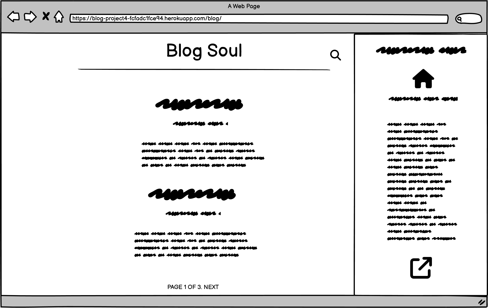

### Mobile Wireframe

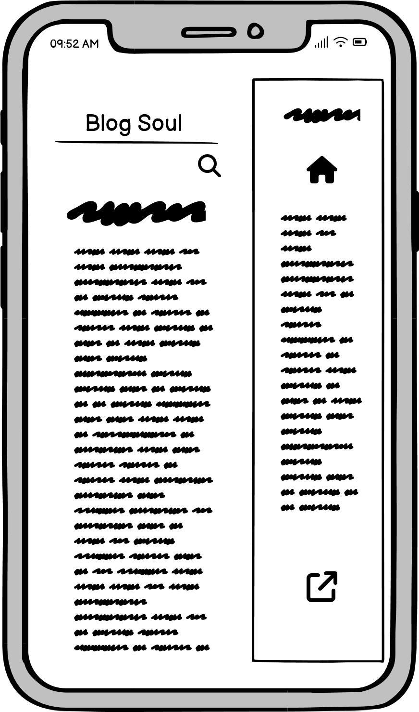

## Website Screenshots

### Front Page

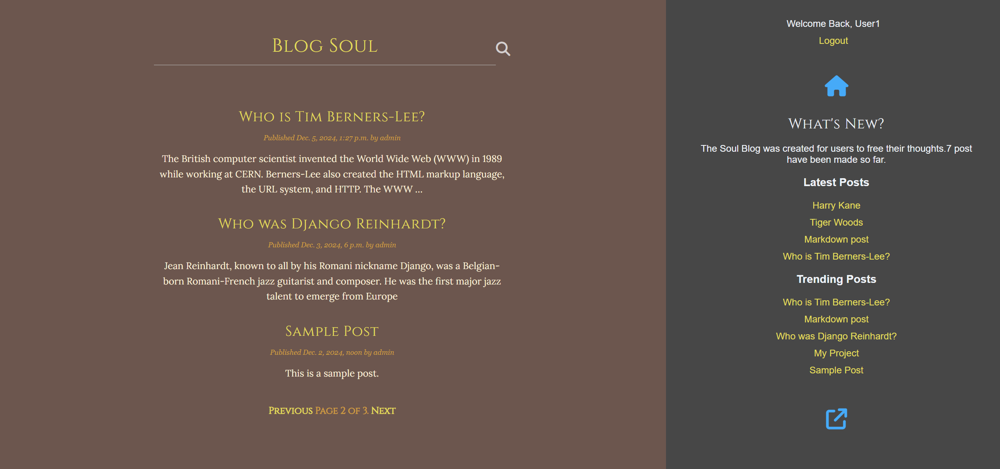

### Test Page

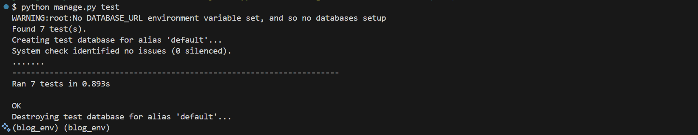

### Signup Page

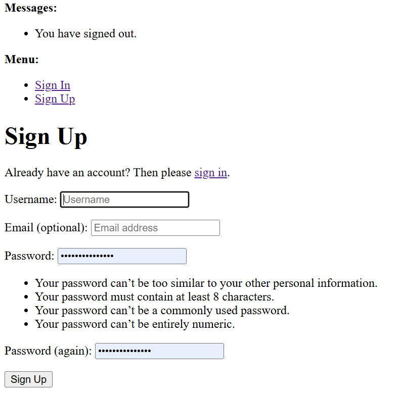

### Signout Page

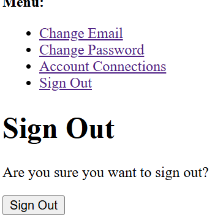

### Signin Page

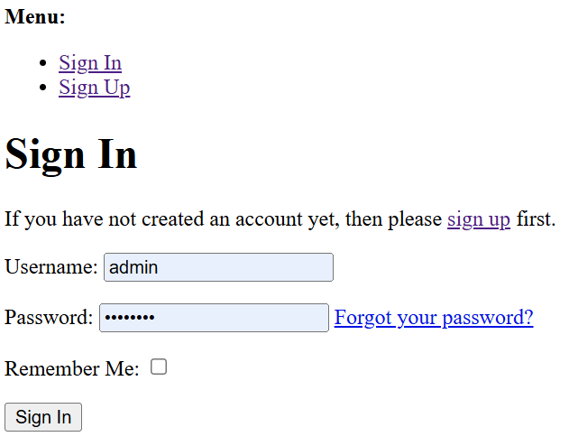

### Sidebar

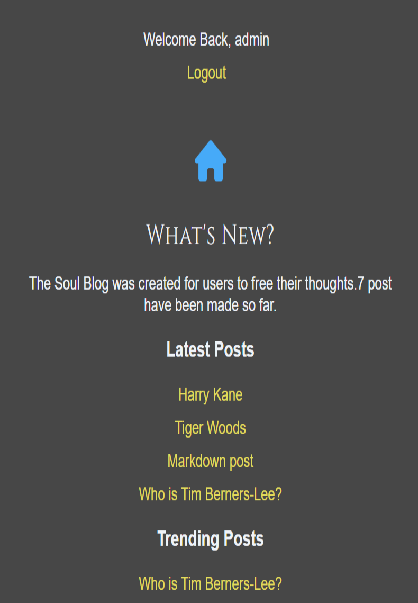

### Share Post

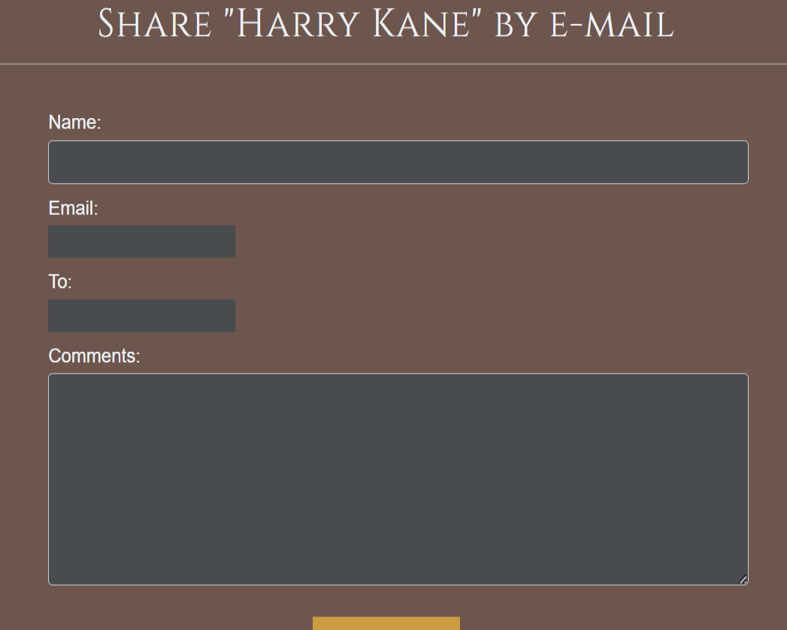

### Search Icon


### Register/Login Button


### Password Reset

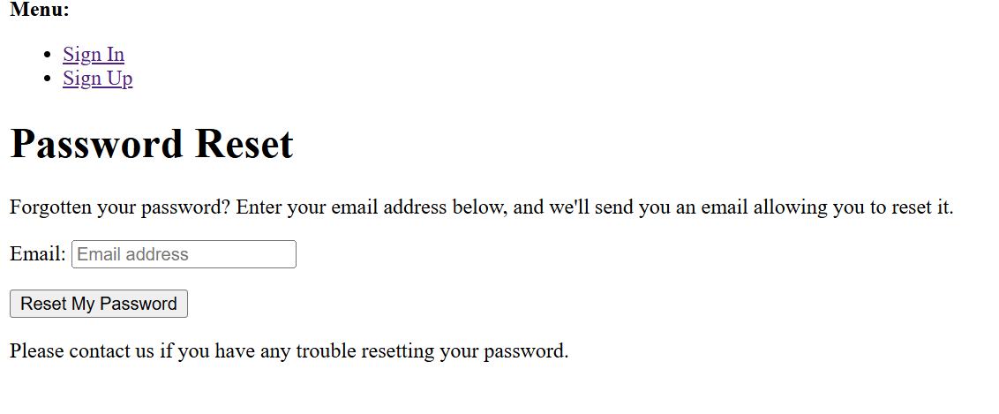

### New Create


### Logged Status

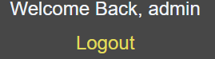

### Linter

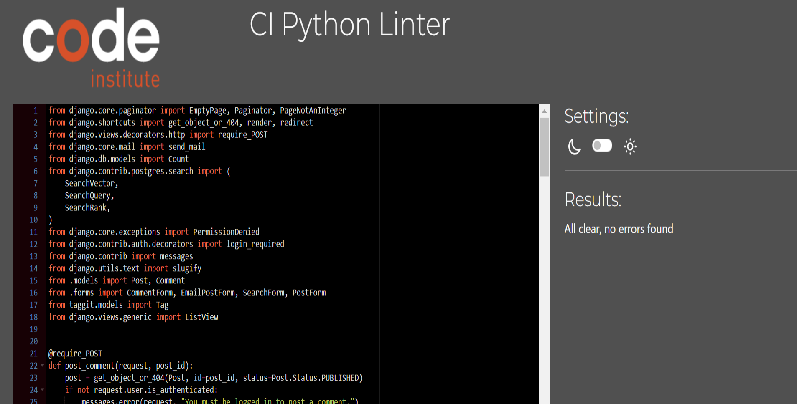

### Lighthouse

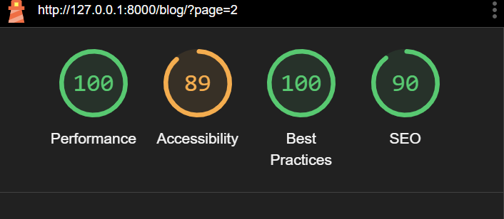

### JS Hint

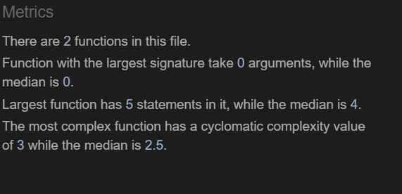

### Home Page


### Comment Section

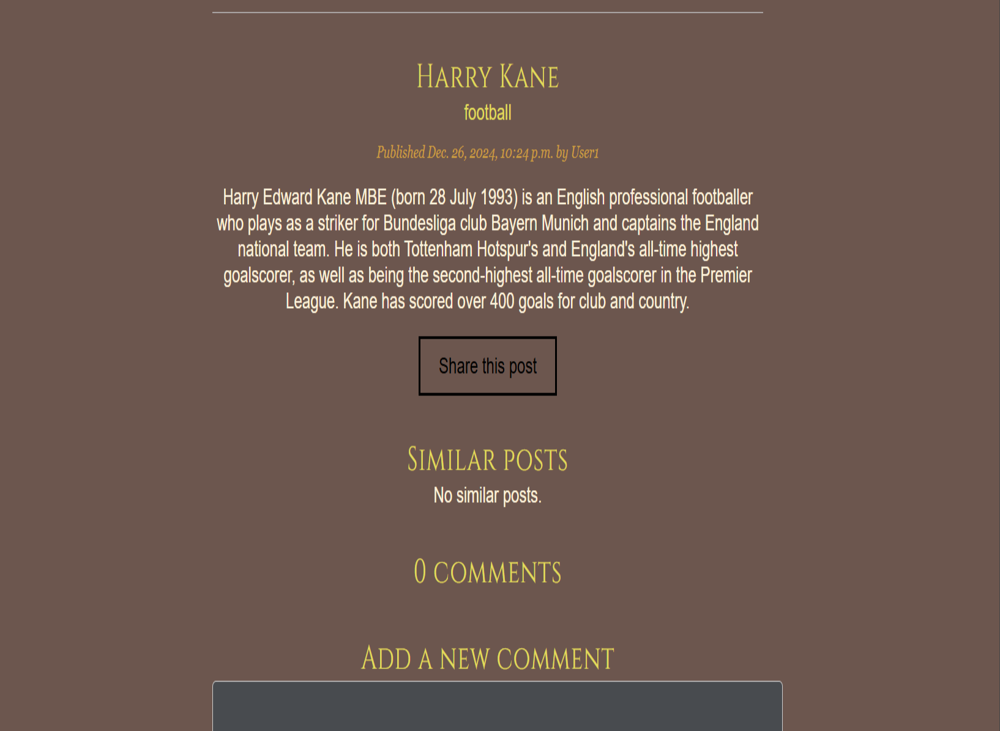

### Agile


