# Blog Soul

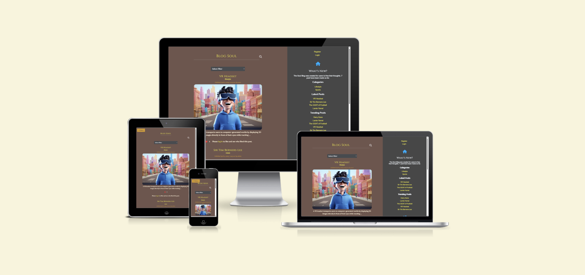

A fully responsive blog website built with Django. This project supports user authentication, dynamic content, and searching with trigram similarity.

- **Responsive Design Testing**: Site performs well across devices

**🔗 Live Site:** [Soul Blog](https://blog-project4-fcfadc1fce94.herokuapp.com/blog/)  
**📁 Repository:** [GitHub Repo](https://github.com/OJarvey/blog.project4.git)

## Table of Contents
- [Overview](#overview)
- [User Experience (UX)](#user-experience-ux)
  - [Strategy](#strategy)
  - [Scope](#scope)
  - [Agile Development](#agile-development)
  - [Structure](#structure)
  - [Database Schema](#database-schema)
  - [Skeleton](#skeleton)
  - [Surface](#surface)
- [Features](#features)
- [Technologies Used](#technologies-used)
- [Testing](#testing)
- [Known Bugs & Fixes](#known-bugs--fixes)
- [Deployment](#deployment)
- [Credits](#credits)
- [Screenshots](#screenshots)

## Overview

Blog Soul is a blogging platform that enables users to create, edit, and delete blog posts. Visitors can view posts and search for specific content. Users can register, log in, and manage their own posts.

## User Experience (UX)

This site was designed using the Five Planes of UX methodology.

### Strategy

**Goal:** Create an intuitive, responsive, and feature-rich blogging platform for users to share and discover content.

**Objectives:**
- Provide user-friendly interfaces for browsing and managing posts
- Ensure seamless mobile and desktop experiences

### Scope

**User Features:**
- Responsive layout across devices
- CRUD functionality for blog posts
- Authentication and account management
- Search functionality with trigram similarity

Only owners of a data instance can access CRUD functionality related to it. All GET requests returning a list will only return items for which the user is the owner. Any requests for a specific item that the user doesn't own will be denied.

**Admin Features:**
- Manage user posts
- View and delete inappropriate content from the admin

### Agile Development

This project was developed using the Agile methodology. All epics and user stories implementation progress was tracked using GitHub's Kanban board, moving items from **ToDo**, to **In Progress**, **Done** and **Not Implemented** lists.

The board can be viewed [here](https://github.com/users/OJarvey/projects/5)

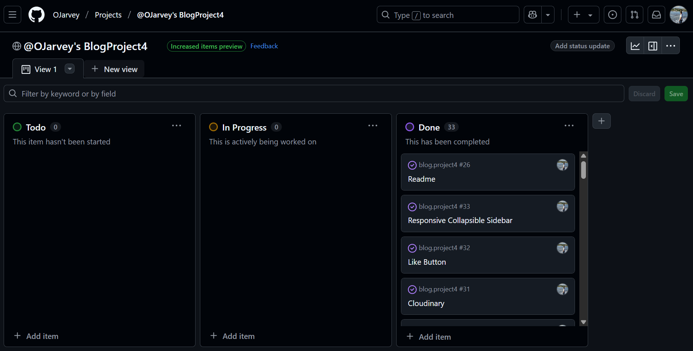

Key development included:
1. **Base Setup**: Project structure, database models, initial styling
2. **Navigation & Authentication**: Navbar, login/registration
3. **Styling and UI**: Homepage design, post styling, visual elements
4. **CRUD Operations**: Post creation, editing, deletion functionality

### Structure

The website structure is designed to make navigation intuitive and efficient for users.

**Navigation:**
- Main Navigation: Includes links to Home, Login/Logout, and Create Post

**Key Pages:**
- Home Page: Displays a list of blog posts with filtering and search options
- Post Detail Page: Shows the full content of a blog post with comments
- Admin Dashboard: Admin-only view for managing posts and users
- User Account Page: Lists user-specific posts with edit/delete options

### Database Schema

The application uses the following database models:

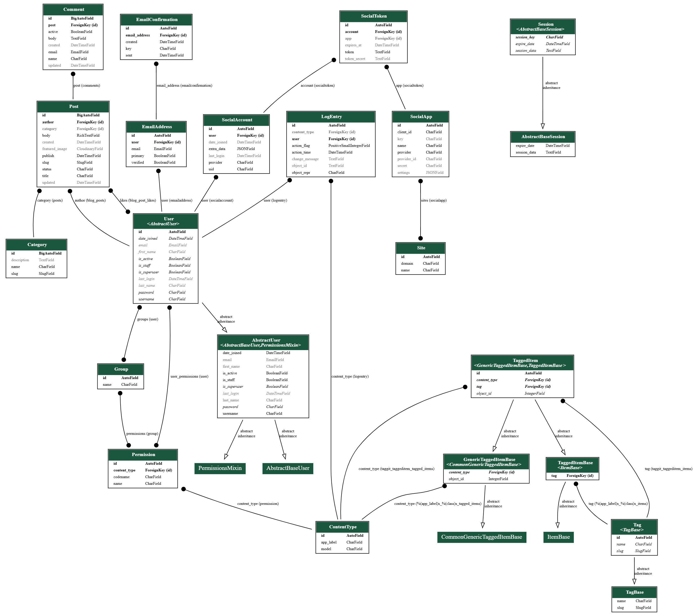

### Skeleton

**Wireframes:**
Wireframes for both mobile and desktop versions were created using Balsamiq.

### Surface

**Color Scheme and Fonts:**
- Colors: Shades of brown and gray for a earthy look.
- Fonts: Google Fonts - Roboto for body text and Montserrat for headings

**Visual Effects:**
- Smooth hover transitions on buttons and links
- Dynamic animations for page transitions

## Features

### Existing Features

- **Post Management**: Users can create, read, update, and delete their own posts
- **Advanced Search**: Trigram-based search for precise and fast content discovery
- **User Authentication**: Secure registration and login system
- **Responsive Design**: Optimized for all screen sizes
- **Like System**: Users can like posts and view like counts
- **Comment System**: Users can add and delete comments on posts
- **Share Functionality**: Posts can be shared via social media

#### Navigation and UI Elements

1. **Main Navigation**
   - **Home Button**: Quick navigation to the home page

     

   - **Menu Sidebar Button**: Access to site navigation options

     

   - **Search Icon**: Opens search functionality

     

2. **User Actions**
   - **Register/Login Button**: Entry point for user authentication

     

   - **Create Post Button**: Quick access to post creation

     

   - **Logged Status Indicator**: Shows current user authentication status

     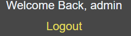

3. **Content Interaction**
   - **Like Button**: Allows users to like posts

     

   - **Show Likes View**: Displays number of likes on a post

     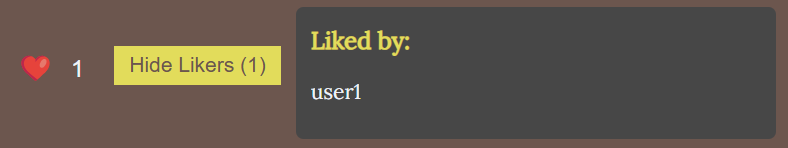

   - **Share Post Icon**: Opens sharing options for posts

     

   - **Comment Management**: Users can delete their own comments

     

4. **Content Navigation**
   - **Pagination**: Navigate through multiple pages of content

     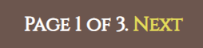

   - **Content Filtering**: Filter content by category or tags

     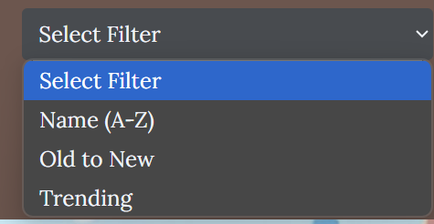

   - **Sidebar Navigation**: Access all site sections

     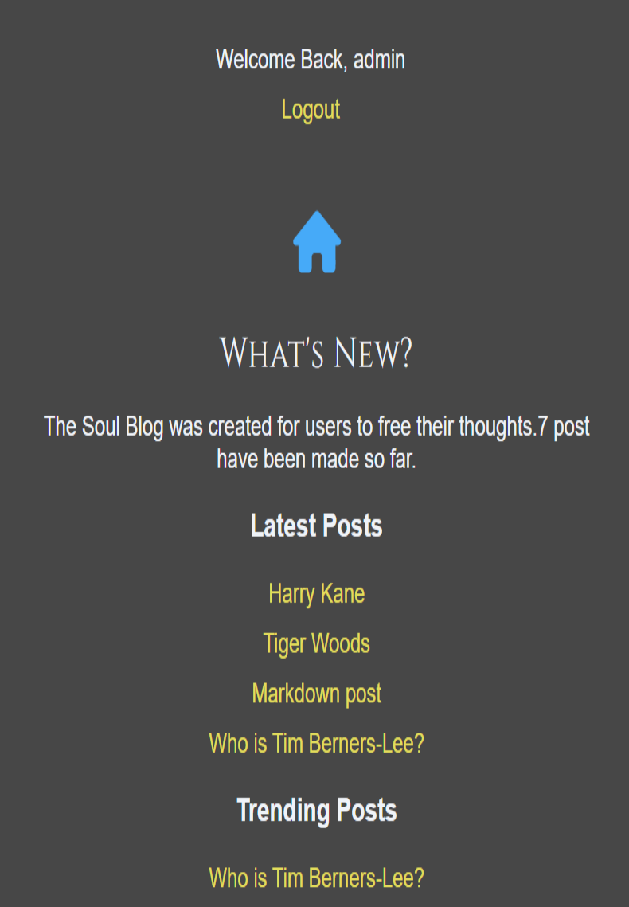

### Potential Future Features

- Enhanced user profile management
- Categories and tags for better content organization
- Newsletter subscription
- Advanced analytics for post authors

## Technologies Used

- **Frontend**: HTML, CSS, JavaScript, Bootstrap
- **Backend**: Django
- **Database**: PostgreSQL
- **Development Tools**:
  - [GitHub](https://github.com/) for version control
  - [VS Code](https://code.visualstudio.com/) for development
  - [Heroku](https://dashboard.heroku.com/) for deployment
  - [Balsamiq](https://balsamiq.com/wireframes/) for wireframes
  - [Favicon.io](https://favicon.io/) for favicon creation
  - [Font Awesome](https://fontawesome.com/) for icons
  - [Google Fonts](https://fonts.google.com/) for typography
  - [GraphViz](https://graphviz.org/) for creating architecture diagrams
  - [Code Institute Pylint](https://pep8ci.herokuapp.com/) for Python validation
  - [W3C HTML Validator](https://validator.w3.org/) for HTML validation
  - [Jigsaw CSS Validator](https://jigsaw.w3.org/css-validator/) for CSS validation
  - [Chrome Dev Tools](https://developer.chrome.com/docs/devtools/) for debugging
  - [Chrome Lighthouse](https://developer.chrome.com/docs/lighthouse/overview/) for performance testing
  
**Python Packages**:
- Django
- Whitenoise
- Psycopg2

## Testing

Extensive manual and automated testing was conducted for all features, ensuring robustness and usability.

### Validation Results

- **HTML Validation**: All pages pass W3C validation

  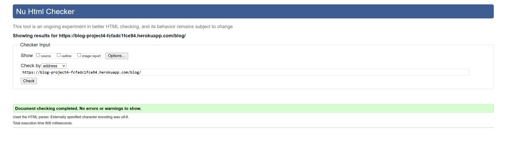

- **CSS Validation**: Stylesheet passes Jigsaw validation

  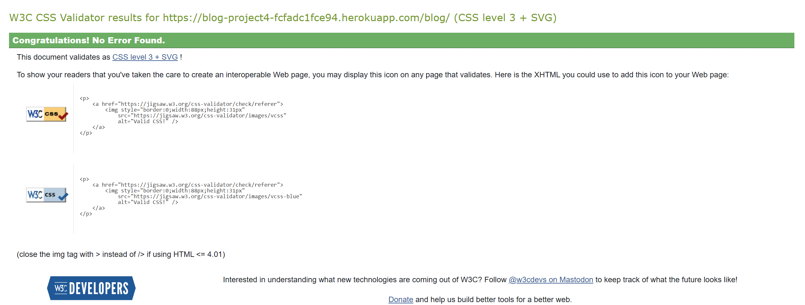

- **JavaScript Validation**: JS files pass JSHint validation

  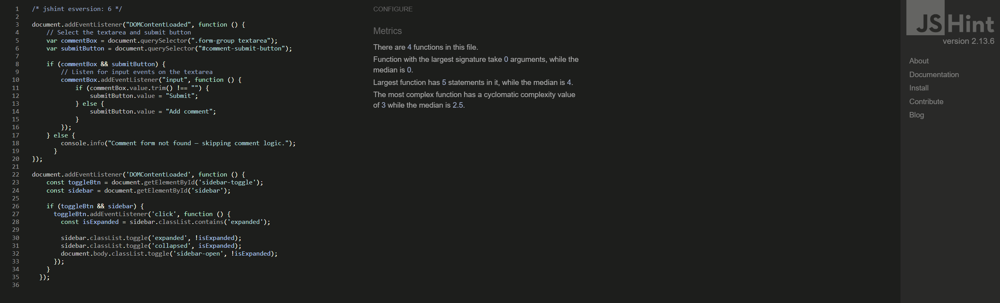

  

- **Python Validation**: Code passes PEP8 standards

  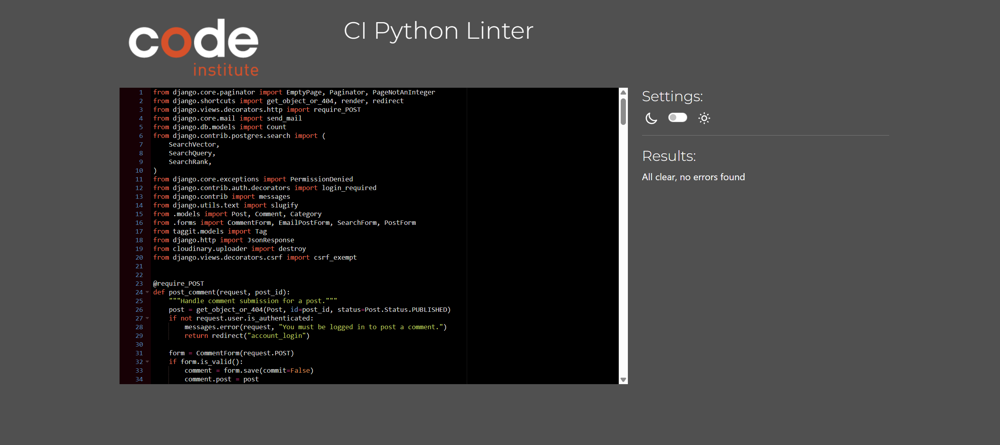

- **Lighthouse Testing**: Strong performance metrics

  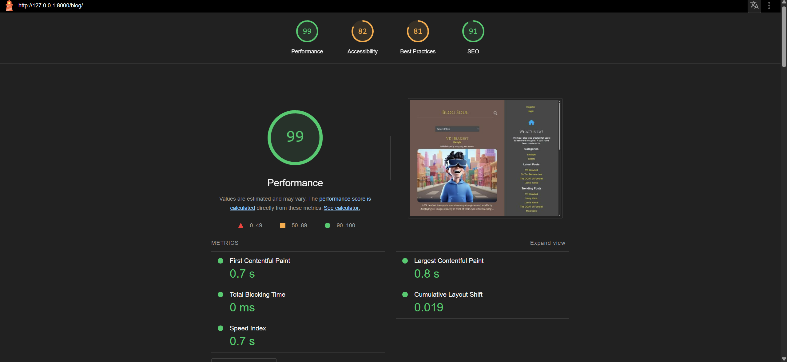

## Known Bugs & Fixes

| Issue                        | Description                                               | Fix                                                              |
| ---------------------------- | --------------------------------------------------------- | ---------------------------------------------------------------- |
| CSS Issues on Deployment     | CSS not loading correctly after deploying to Heroku.      | Installed Whitenoise and updated middleware configuration.       |
| 500 Error on Post Creation   | Server error when creating posts.                         | Added proper user association in the view logic.                 |
| Search Function Issues       | Search feature returned no results even for matching terms. | Added trigram extension and proper GIN indexing to the database. |
| User Redirection After Login | Users not redirected properly after login.                | Updated login view to handle the 'next' parameter.               |
| CSRF Token Errors            | Forms failed to submit due to missing CSRF tokens.        | Added `` to all form templates.                |
| Image Upload Problems        | Uploaded images not displaying on blog posts.             | Added proper media configurations in `settings.py`.               |
| URL Routing Issues           | "Post Not Found" errors on valid posts.                   | Updated slug generation logic using Django's `slugify`.          |

## Deployment

### Setting up the Database
1. Initialize and migrate the database using Django's migration tools:
   ```
   python manage.py makemigrations
   python manage.py migrate
   ```

### Heroku Deployment
1. Create a Heroku app and connect the GitHub repository
2. Add environment variables for database connection and secret keys
3. Deploy from the main branch

### Fork the Repository
Follow the GitHub fork instructions to create a personal copy of the repository.

### Clone the Repository
Use the `git clone` command to download the repository to your local machine.

## Credits

**Code:**
- Django documentation for ORM and views
- Bootstrap documentation for frontend components
- Django 5 book for setup [here](https://amzn.eu/d/62R6ksJ)

**Acknowledgements:**
- Special thanks to mentors and peers who provided valuable feedback and guidance during development.

## Screenshots

<details>
<summary>🖥️ Desktop & Mobile Views</summary>

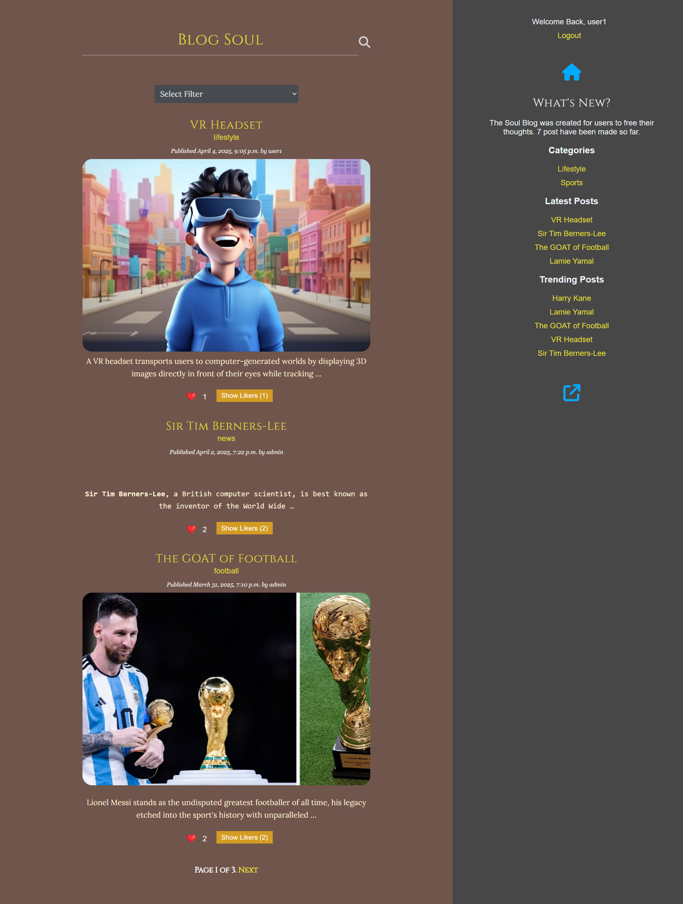
<br>

*Main page view on desktop showing the blog posts layout (Width: 600px)*

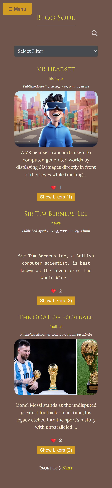
<br>

*Mobile responsive view of the main page*

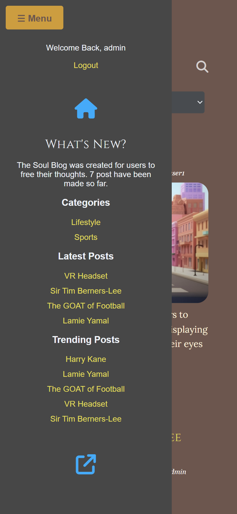
<br>

*Mobile navigation sidebar showing menu options*

</details>

<details>
<summary>🔑 User Authentication Views</summary>

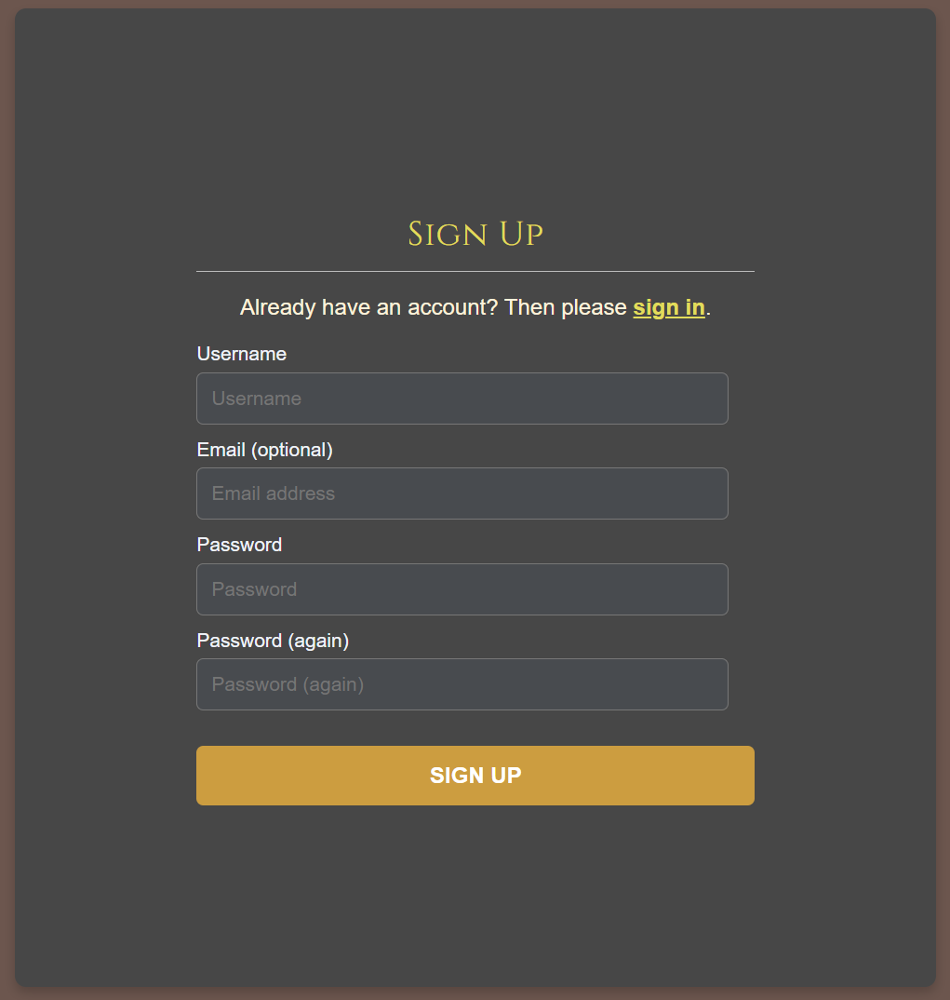
<br>

*User registration page*

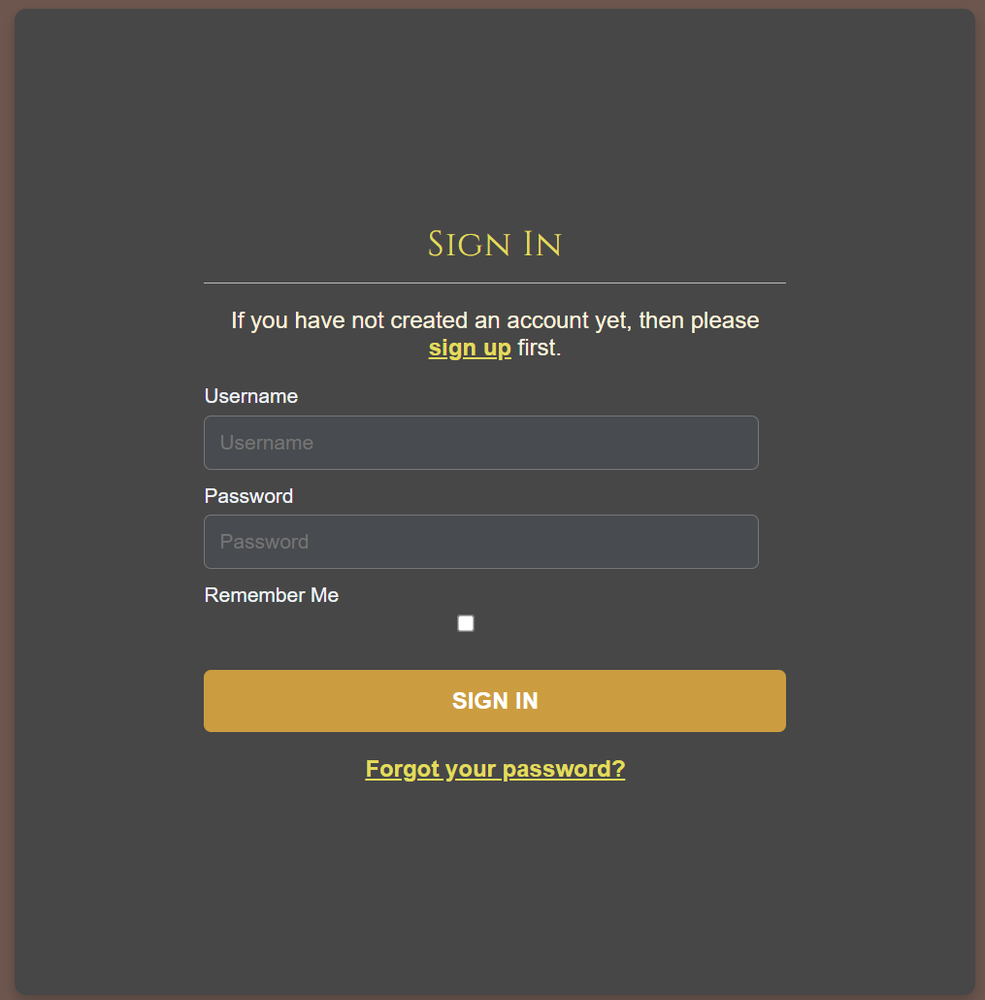
<br>

*User login page*

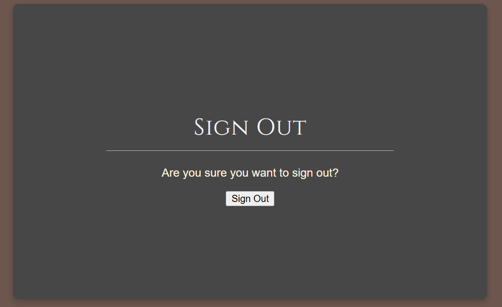
<br>

*Logout confirmation page*

</details>

<details>
<summary>🔄 Password Reset Flow</summary>

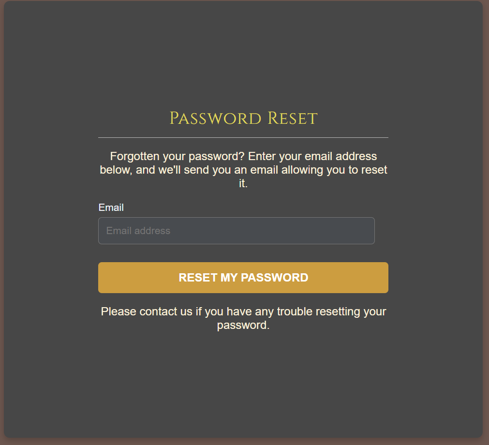
<br>

*Password reset request page*

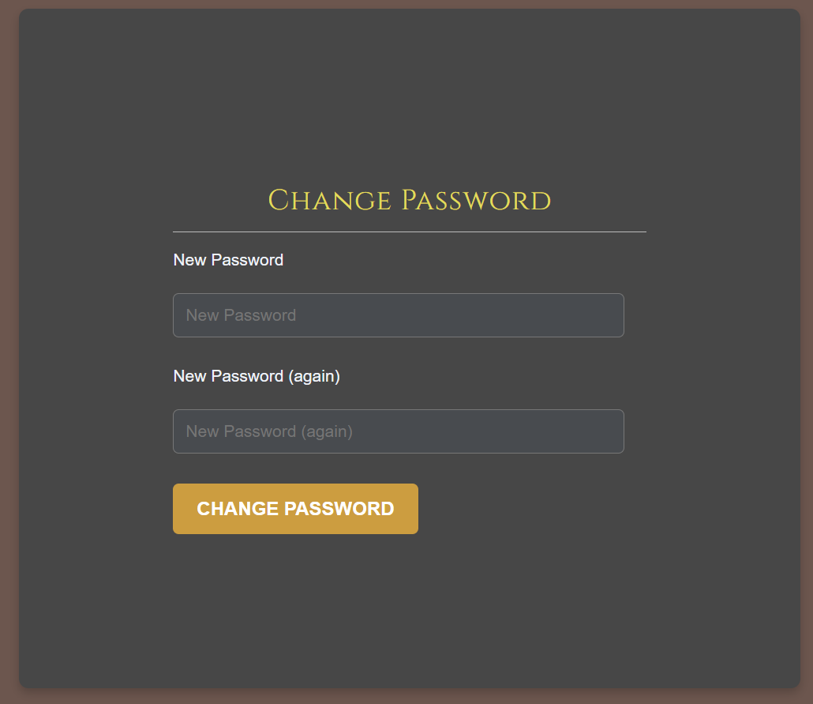
<br>

*Password reset form for entering new password*

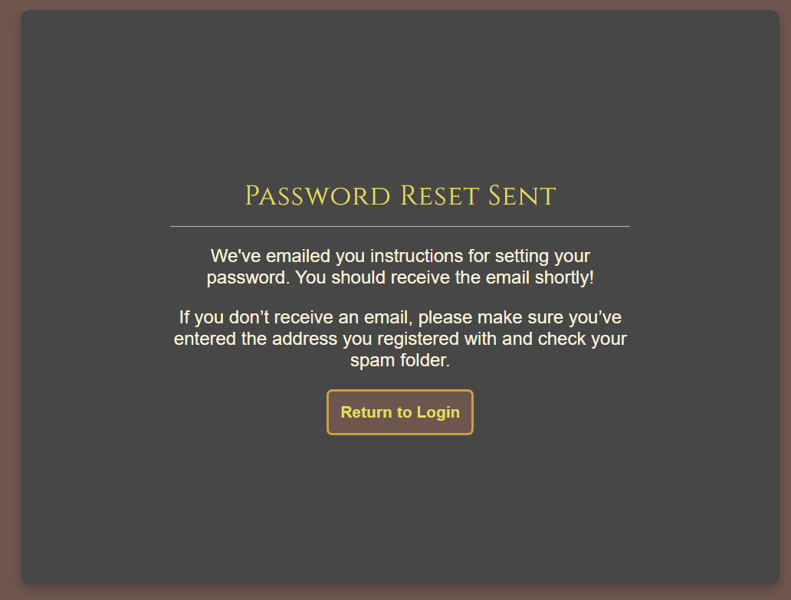
<br>

*Confirmation page after password reset*

</details>

<details>

<summary>💬 Content Interaction</summary>

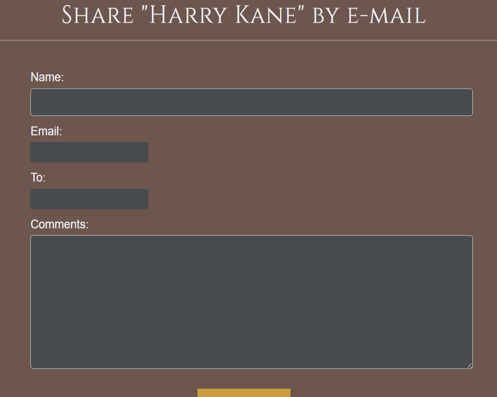

<br>

*Share post modal with social media options*

</details>
