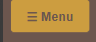
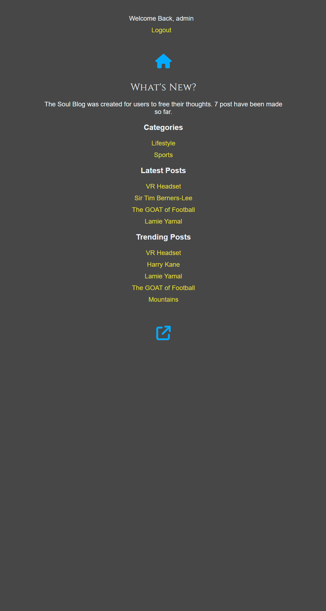
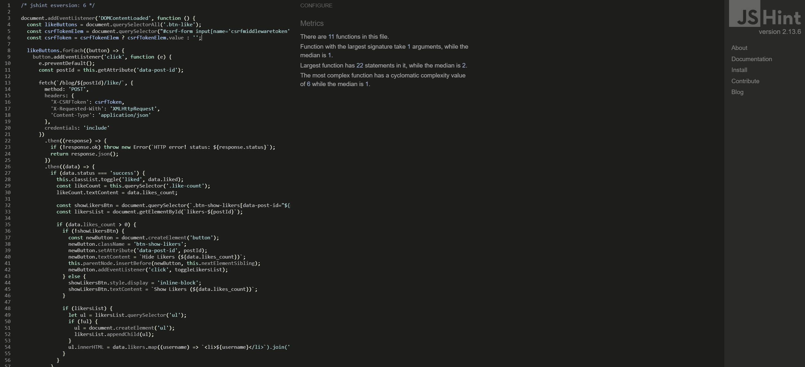

# Blog Soul


A fully responsive blog website built with Django. This project supports user authentication, dynamic content, and searching with trigram similarity.

- **Responsive Design Testing**: Site performs well across devices

**🔗 Live Site:** [Soul Blog](https://blog-project4-fcfadc1fce94.herokuapp.com/blog/)  
**📁 Repository:** [GitHub Repo](https://github.com/OJarvey/blog.project4.git)

## Table of Contents
- [Overview](#overview)
- [User Experience (UX)](#user-experience-ux)
  - [Strategy](#strategy)
  - [Scope](#scope)
  - [Agile Development](#agile-development)
  - [Structure](#structure)
  - [Database Schema](#database-schema)
  - [Skeleton](#skeleton)
  - [Wireframes](#wireframes)
  - [Surface](#surface)
- [Features](#features)
- [Technologies Used](#technologies-used)
- [Setup and Installation](#setup-and-installation)
- [Testing](#testing)
- [Known Bugs & Fixes](#known-bugs--fixes)
- [Deployment](#deployment)
- [Credits](#credits)
- [User View](#user-view)

## Overview

Blog Soul is a blogging platform that enables users to create, edit, and delete blog posts. Visitors can view posts and search for specific content. Users can register, log in, and manage their own posts.

## User Experience (UX)

This site was designed using the Five Planes of UX methodology.

### Strategy

**Goal:** Create an intuitive, responsive, and feature-rich blogging platform for users to share and discover content.

**Objectives:**
- Provide user-friendly interfaces for browsing and managing posts
- Ensure seamless mobile and desktop experiences

### Scope

**User Features:**
- Responsive layout across devices
- CRUD functionality for blog posts
- Authentication and account management
- Search functionality with trigram similarity

Only owners of a data instance can access CRUD functionality related to it. All GET requests returning a list will only return items for which the user is the owner. Any requests for a specific item that the user doesn't own will be denied.

**Admin Features:**
- Manage user posts
- View and delete inappropriate content from the admin

### Agile Development

This project was developed using the Agile methodology. All epics and user stories implementation progress was tracked using GitHub's Kanban board, moving items from **ToDo**, to **In Progress**, **Done** and **Not Implemented** lists.

The board can be viewed [here](https://github.com/users/OJarvey/projects/5)

<details>
<summary> 📊 Agile development board </summary>


<br>

</details>

Key development included:
1. **Base Setup**: Project structure, database models, initial styling
2. **Navigation & Authentication**: Navbar, login/registration
3. **Styling and UI**: Homepage design, post styling, visual elements
4. **CRUD Operations**: Post creation, editing, deletion functionality

### Structure

The website structure is designed to make navigation intuitive and efficient for users.

**Navigation:**
- Main Navigation: Includes links to Home, Login/Logout, and Create Post

**Key Pages:**
- Home Page: Displays a list of blog posts with filtering and search options
- Post Detail Page: Shows the full content of a blog post with comments
- Admin Dashboard: Admin-only view for managing posts and users
- User Account Page: Lists user-specific posts with edit/delete options

### Database Schema

The application uses the following database models:

<details>
<summary> 📝 Database Diagram </summary>


<br>

</details>

### Skeleton

The skeleton plane focuses on the interface design and navigation structure that brings the information architecture to life. This includes wireframes for both mobile and desktop versions to ensure a consistent user experience across all devices.

### Wireframes

Wireframes for both mobile and desktop versions were created using Balsamiq to plan the layout and user flow of the application.

<details>
<summary> 🏠 Home Page Wireframes </summary>

**Desktop Home Page**


**Mobile Home Page**


</details>

<details>

<summary> 📝 Post Details Wireframes </summary>

**Desktop Post Details**


**Mobile Post Details**


</details>

<details>

<summary> ✏️ Create Post Wireframes </summary>

**Desktop Create Post**


**Mobile Create Post**


</details>

<details>

<summary> 🔑 Authentication Wireframes </summary>

**Desktop Login**


**Mobile Login**


**Desktop Signup**


**Mobile Signup**


**Desktop Logout**


**Mobile Logout**


</details>

<details>

<summary> 🔄 Password Reset Wireframes </summary>

**Desktop Password Reset**


**Mobile Password Reset**


</details>

<details>
<summary> 📱 Menu & Share Wireframes </summary>

**Mobile Menu**


**Desktop Share**


**Mobile Share**


</details>

### Surface

**Color Scheme and Fonts:**
- Colors: Shades of brown and gray for a earthy look.
- Fonts: Google Fonts - Roboto for body text and Montserrat for headings

**Visual Effects:**
- Smooth hover transitions on buttons and links
- Dynamic animations for page transitions

## Features

### Existing Features

- **Post Management**: Users can create, read, update, and delete their own posts
- **Advanced Search**: Trigram-based search for precise and fast content discovery
- **User Authentication**: Secure registration and login system
- **Responsive Design**: Optimized for all screen sizes
- **Like System**: Users can like posts and view like counts
- **Comment System**: Users can add and delete comments on posts
- **Share Functionality**: Posts can be shared via social media

#### Navigation and UI Elements

1. **Main Navigation**
   - **Home Button**: Quick navigation to the home page

     

   - **Menu Sidebar Button**: Access to site navigation options

     

   - **Search Icon**: Opens search functionality

     

2. **User Actions**
   - **Register/Login Button**: Entry point for user authentication

     

   - **Create Post Button**: Quick access to post creation

     

   - **Logged Status Indicator**: Shows current user authentication status

     

3. **Content Interaction**
   - **Like Button**: Allows users to like posts

     

   - **Show Likes View**: Displays number of likes on a post

     

   - **Share Post Icon**: Opens sharing options for posts

     

   - **Comment Management**: Users can delete their own comments

     

4. **Content Navigation**
   - **Pagination**: Navigate through multiple pages of content

     

   - **Content Filtering**: Filter content by category or tags

     

   - **Sidebar Navigation**: Access all site sections
      <details>
          <summary> Sidebar </summary>
          
          <br>
      </details>

### Potential Future Features

- Enhanced user profile management
- Categories and tags for better content organization
- Newsletter subscription
- Advanced analytics for post authors

## Technologies Used

- **Frontend**: HTML, CSS, JavaScript, Bootstrap
- **Backend**: Django
- **Database**: PostgreSQL
- **Development Tools**:
  - [GitHub](https://github.com/) for version control
  - [VS Code](https://code.visualstudio.com/) for development
  - [Heroku](https://dashboard.heroku.com/) for deployment
  - [Balsamiq](https://balsamiq.com/wireframes/) for wireframes
  - [Favicon.io](https://favicon.io/) for favicon creation
  - [Font Awesome](https://fontawesome.com/) for icons
  - [Google Fonts](https://fonts.google.com/) for typography
  - [GraphViz](https://graphviz.org/) for creating architecture diagrams
  - [Code Institute Pylint](https://pep8ci.herokuapp.com/) for Python validation
  - [W3C HTML Validator](https://validator.w3.org/) for HTML validation
  - [Jigsaw CSS Validator](https://jigsaw.w3.org/css-validator/) for CSS validation
  - [Chrome Dev Tools](https://developer.chrome.com/docs/devtools/) for debugging
  - [Chrome Lighthouse](https://developer.chrome.com/docs/lighthouse/overview/) for performance testing
  
**Python Packages**:
- Django
- Whitenoise
- Psycopg2

## Setup and Installation

### Prerequisites
- Python 3.8+
- pip
- Git

### Local Development Setup

1. **Clone the repository**
   ```bash
   git clone https://github.com/OJarvey/blog.project4.git
   cd blog.project4
   ```

2. **Create a virtual environment**
   ```bash
   python -m venv venv
   source venv/bin/activate  # On Windows: venv\Scripts\activate
   ```

3. **Install dependencies**
   ```bash
   pip install -r requirements.txt
   ```

4. **Set up environment variables**
   Create a `.env` file in your project root with:
   ```
   SECRET_KEY=your-django-secret-key
   DATABASE_URL=your-database-url
   CLOUDINARY_URL=your-cloudinary-url
   EMAIL_HOST_USER=your-email@example.com
   EMAIL_HOST_PASSWORD=your-app-password
   DEFAULT_FROM_EMAIL="Soul Blog <your-email@example.com>"
   DEVELOPMENT=True
   ```

5. **Run migrations**
   ```bash
   python manage.py makemigrations
   python manage.py migrate
   ```

6. **Create a superuser**
   ```bash
   python manage.py createsuperuser
   ```

7. **Run the development server**
   ```bash
   python manage.py runserver
   ```

## 🚀 Project Deployment: Heroku

### 1. Initial Setup on Heroku
1. Sign in to [Heroku](https://www.heroku.com/).
2. Click **New > Create New App**.
3. Name your app (e.g., `soul-blog`).
4. Choose a region and click **Create app**.

### 2. Set Up PostgreSQL
1. Navigate to the **Resources** tab.
2. Add **Heroku Postgres** from the Add-ons section.
3. Go to **Settings > Config Vars**, and copy the `DATABASE_URL`.

### 3. Configure Environment Variables in Heroku
Add the following Config Vars under **Settings**:
- `SECRET_KEY`: your Django secret key
- `DATABASE_URL`: your Postgres database URL (added automatically)
- `CLOUDINARY_URL`: your Cloudinary URL
- `EMAIL_HOST_USER`: your email for sending notifications
- `EMAIL_HOST_PASSWORD`: your email app password
- `DEFAULT_FROM_EMAIL`: "Soul Blog <your-email@example.com>"
- `DISABLE_COLLECTSTATIC`: 1 (only for initial deployment)

### 4. Install and Configure Cloudinary
1. Sign up or log into [Cloudinary](https://cloudinary.com/).
2. Copy your `CLOUDINARY_URL` and add it to Heroku Config Vars.
3. Make sure you have installed the packages:
   ```bash
   pip install django-cloudinary-storage cloudinary
   ```

### 5. Final Project Configurations

**Create a Procfile**
Create a file named `Procfile` (no extension) in your root directory:
```
web: gunicorn myblog.wsgi
```

**Update settings.py**
Make sure your `settings.py` includes:
```python
STATIC_URL = 'static/'
STATICFILES_DIRS = [BASE_DIR / 'blog/static']
STATIC_ROOT = BASE_DIR / 'staticfiles'
STATICFILES_STORAGE = 'whitenoise.storage.CompressedManifestStaticFilesStorage'
DEFAULT_FILE_STORAGE = 'cloudinary_storage.storage.MediaCloudinaryStorage'
CLOUDINARY_URL = os.environ.get("CLOUDINARY_URL")
ALLOWED_HOSTS = [
    'localhost',
    '127.0.0.1',
    'your-heroku-app.herokuapp.com',
]
TEMPLATES = [
    {
        ...
        "DIRS": [BASE_DIR / "blog/templates"],
        ...
    }
]
```

### 6. Deploy to Heroku
1. Push your project to GitHub.
2. In Heroku → Deploy tab → Connect your GitHub repo.
3. Deploy the main branch manually or enable automatic deploys.

### 7. Run Migrations and Collect Static Files
In your terminal:
```bash
heroku run python manage.py migrate
heroku run python manage.py createsuperuser
heroku run python manage.py collectstatic --noinput
```

### 8. Remove the DISABLE_COLLECTSTATIC Variable
Once your first deployment is successful, go back to Config Vars and remove the `DISABLE_COLLECTSTATIC` variable.

### 9. Access Your Application
Your application should now be available at `https://your-app-name.herokuapp.com`

## Testing

<h3> Both manual and automated testing was carried out across all major features to ensure functionality.</h3>

* To carry out automated testing a [Test.py](blog/tests.py) file was created and `python manage.py` test was ran in terminal to start testing.

- **Automated Testing**: All testing pass
      <details>
          <summary> Testing </summary>
          
          <br>
      </details>

<h4> This project uses django-ckeditor (CKEditor 4). For future improvements, switching to CKEditor 5 or another secure modern editor is recommended. </h4>

### Validation Results

- **HTML Validation**: All pages pass W3C validation
      <details>
          <summary> HTML Validation </summary>
          
          <br>
      </details>

- **CSS Validation**: Stylesheet passes Jigsaw validation
      <details>
          <summary> CSS Validation </summary>
          
          <br>
      </details>

- **JavaScript Validation**: JS files pass JSHint validation
      <details>
          <summary> Script JSHint Validation </summary>
          
          <br>
      </details>

    <details>
        <summary> Likes JSHint Validation </summary>
        
        <br>
    </details>

- **Python Validation**: Code passes PEP8 standards
      <details>
        <summary> Python Linter Testing </summary>
        
        <br>
    </details>

- **Lighthouse Testing**: Strong performance metrics

    <details>
        <summary> Lighthouse Test </summary>
        
        <br>
    </details>

## Known Bugs & Fixes

| Issue                        | Description                                               | Fix                                                              |
| ---------------------------- | --------------------------------------------------------- | ---------------------------------------------------------------- |
| CSS Issues on Deployment     | CSS not loading correctly after deploying to Heroku.      | Installed Whitenoise and updated middleware configuration.       |
| 500 Error on Post Creation   | Server error when creating posts.                         | Added proper user association in the view logic.                 |
| Search Function Issues       | Search feature returned no results even for matching terms. | Added trigram extension and proper GIN indexing to the database. |
| User Redirection After Login | Users not redirected properly after login.                | Updated login view to handle the 'next' parameter.               |
| CSRF Token Errors            | Forms failed to submit due to missing CSRF tokens.        | Added `` to all form templates.                |
| Image Upload Problems        | Uploaded images not displaying on blog posts.             | Added proper media configurations in `settings.py`.               |
| URL Routing Issues           | "Post Not Found" errors on valid posts.                   | Updated slug generation logic using Django's `slugify`.          |

## Deployment

This site is deployed via Heroku with PostgreSQL database, Cloudinary for media storage, and Whitenoise for static files.

For deployment steps, see the [Setup and Installation](#setup-and-installation) section above.

### Fork the Repository
To create your own copy of this project:
1. Log in to GitHub and navigate to the [Blog Soul repository](https://github.com/OJarvey/blog.project4.git)
2. Click the "Fork" button in the top right corner of the page
3. Make your desired changes to your copy of the repository

### Clone the Repository
To create a local copy on your machine:
```bash
git clone https://github.com/OJarvey/blog.project4.git
cd blog.project4
```

## Credits

**Code:**
- Django documentation for ORM and views
- Bootstrap documentation for frontend components
- Django 5 book for setup [here](https://amzn.eu/d/62R6ksJ)

**Acknowledgements:**
- Special thanks to mentors and peers who provided valuable feedback and guidance during development.

## User View

<details>
<summary>🖥️ Desktop & Mobile Views</summary>


<br>

*Main page view on desktop showing the blog posts layout*


<br>

*Mobile responsive view of the main page*


<br>

*Mobile navigation sidebar showing menu options*

</details>

<details>
<summary>🔑 User Authentication Views</summary>


<br>

*User registration page*


<br>

*User login page*


<br>

*Logout confirmation page*

</details>

<details>
<summary>🔄 Password Reset Flow</summary>


<br>

*Password reset request page*


<br>

*Password reset form for entering new password*


<br>

*Confirmation page after password reset*

</details>

<details>
<summary>💬 Content Interaction</summary>


<br>

*Share post modal with social media options*

</details>
